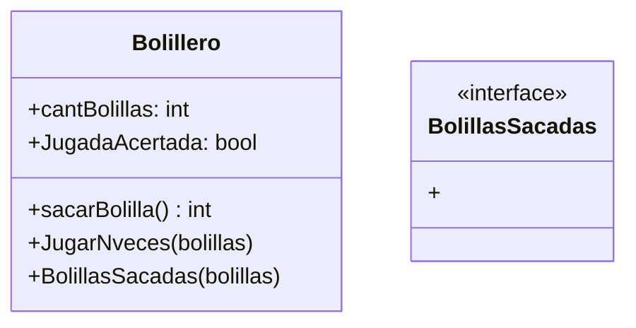

## Documentacion

```mermaid
classDiagram
    class Bolillero{
        +cantBolillas: int 
        +JugadaAcertada: bool
        +sacarBolilla() int
        +JugarNveces<list>(bolillas)
        +BolillasSacadas<list>(bolillas)
}
    class BolillasSacadas{
        <<interface>>
        +
    }
```