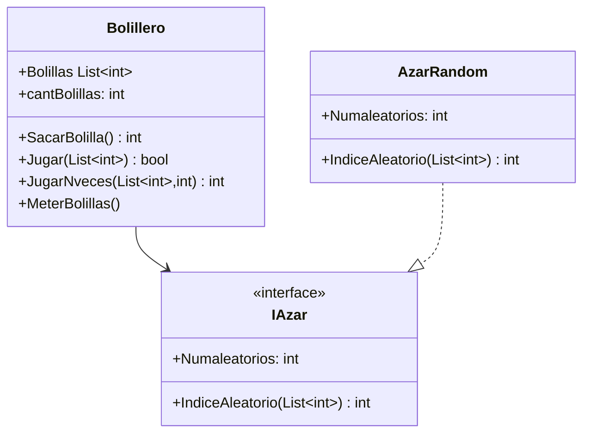

## Documentacion

```mermaid
classDiagram
    class Bolillero{
        +Bolillas List~int~
        +cantBolillas: int 
        +SacarBolilla() int 
        +Jugar(List~int~) bool
        +JugarNveces(List~int~,int) int
        +MeterBolillas() 
        }
    class IAzar{
        <<interface>>
        +Numaleatorios: int
        +IndiceAleatorio(List~int~) int
        }
    class AzarRandom{
        +Numaleatorios: int
        +IndiceAleatorio(List~int~) int
    }

    Bolillero --> IAzar
    AzarRandom ..|> IAzar
```